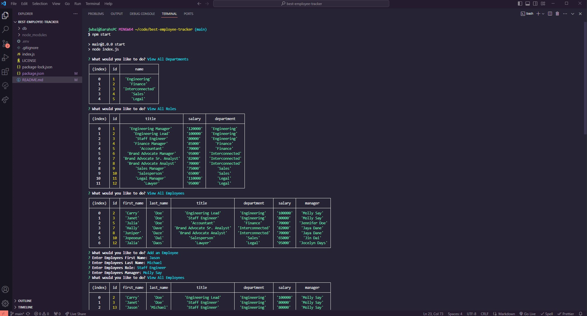

# best-employee-tracker

## Description
This application is for those that need to stay organized and keep track of company roles, salaries and management. It serves as a hub that will allow you to navigate through the CLI and find and manage company records. 

## Installation

You can access this page using the following link. (https://github.com/JBailey007/best-employee-tracker)

## Usage
In order to use this application you will need to do the following steps: 

Access MySQL in your terminal and login. Source the DB files (Schema and Seeds) and then quit out of the mysql.

Run npm start

You will then be presented with a series of questions. 

Use the arrow keys to navigate through the CLI

When a question is asked you can type out the response that you would like and hit enter to move on through the process.

When you are finished simply navigate to the QUIT button and hit enter. 

# Credits
N/A

# Screenshot

## License
Please refer to the LICENSE in the repo. 